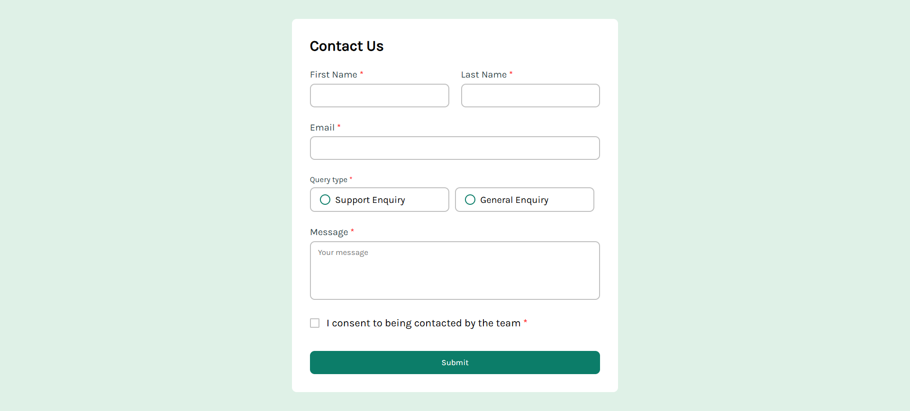

# Frontend Mentor - Contact form solution

This is a solution to the [Contact form challenge on Frontend Mentor](https://www.frontendmentor.io/challenges/contact-form--G-hYlqKJj). Frontend Mentor challenges help you improve your coding skills by building realistic projects.

## Table of contents

- [Overview](#overview)
  - [The challenge](#the-challenge)
  - [Screenshot](#screenshot)
  - [Links](#links)
- [My process](#my-process)
  - [Built with](#built-with)
  - [What I learned](#what-i-learned)
  - [Continued development](#continued-development)
  - [Useful resources](#useful-resources)
- [Author](#author)

## Overview

### The challenge

Users should be able to:

- Complete the form and see a success toast message upon successful submission
- Receive form validation messages if:
  - A required field has been missed
  - The email address is not formatted correctly
- Complete the form only using their keyboard
- Have inputs, error messages, and the success message announced on their screen reader
- View the optimal layout for the interface depending on their device's screen size
- See hover and focus states for all interactive elements on the page

### Screenshot

### Links

- Solution URL: [Add solution URL here](https://github.com/Obada-barakat/Contact-us-challenge)
- Live Site URL: [Add live site URL here](https://obada-barakat.github.io/Contact-us-challenge/)

## My process

### Built with

- Semantic HTML5 markup
- CSS custom properties
- Flexbox
- CSS Grid
- JavaScript
- Mobile-first workflow

### What I learned

During this project, I learned how to effectively handle forms using JavaScript — from capturing input values to checking and validating form data. This process helped me strengthen my logical thinking around form handling and improved the way I approach user input validation. Additionally, I enhanced my design skills by creating user-friendly and visually appealing forms, focusing on both layout and user experience.

### Continued development

In the future, I plan to learn Node.js to deepen my understanding of how to handle backend data effectively using JavaScript. This will allow me to build full-stack applications and improve the way I manage and process data on the server side.

### Useful resources

- [Example resource 1](https://peerdh.com/blogs/programming-insights/creating-custom-error-messages-for-form-validation-in-javascript) - This really gave a great idea about error messages, how to write and design them, to provide a clarity, reduce frustration.

- (without any link it's always Stack Overflow)

## Author

- LinkedIn - [Ubba Obada](https://www.linkedin.com/in/ubba-obada-47b307259)
- Frontend Mentor - [@Obada-barakat](https://www.frontendmentor.io/profile/Obada-barakat)
